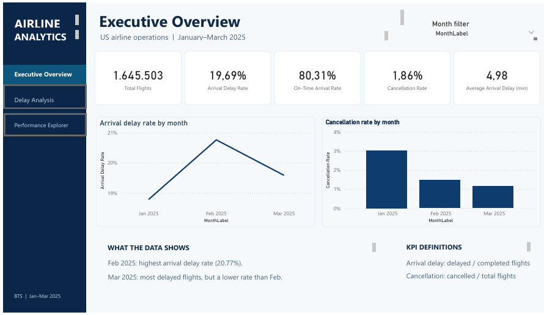
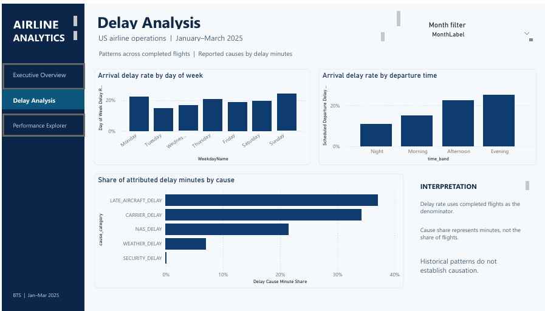
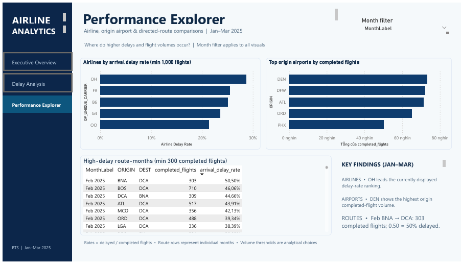

# Airline Operations Analytics & Flight Delay Prediction

A Data Analyst / Data Engineer portfolio project turning **1.65 million flight records** into validated operational KPIs and a three-page Power BI dashboard.

**Status:** Data processing and SQL analytics completed and runtime-validated. Power BI dashboard built; testing and portfolio polish in progress. Machine Learning is planned, not implemented.

## 1. Project Overview

Flight delays and cancellations affect both airline operations and passenger experience. This project investigates where observed performance differs across months, airlines, origin airports, directed routes and scheduled departure times.

The goal is to distinguish **high delay rates from high flight volumes**, use the right population for each KPI, and provide traceable evidence for further operational investigation—not claim causes or business improvements that have not been measured.

The implementation combines schema-aware PySpark processing, readable Spark SQL, Parquet storage and Power BI measures. It runs locally on a 12 GB Windows laptop, without a new data warehouse or orchestration framework.

## 2. Dataset

**Source:** U.S. Bureau of Transportation Statistics, [Reporting Carrier On-Time Performance](https://transtats.bts.gov/DL_SelectFields.aspx?QO_fu146_anzr=&gnoyr_VQ=FGJ).

| Coverage | Records |
|---|---:|
| January 2025 | 539,747 |
| February 2025 | 504,884 |
| March 2025 | 600,872 |
| **Total** | **1,645,503** |

The input contains 36 BTS columns. Cleaning preserves every record and produces 38 columns, adding source-file lineage and flight status.

- **Completed:** `CANCELLED = 0` and `DIVERTED = 0`.
- **Cancelled:** `CANCELLED = 1` and `DIVERTED = 0`.
- **Diverted:** `CANCELLED = 0` and `DIVERTED = 1`.
- Other flag combinations are invalid under the project contract; none were observed.

A delayed arrival is a completed flight with `ARR_DEL15 = 1` (at least 15 minutes late). “On time” means `ARR_DEL15 = 0`: less than 15 minutes late, including early arrivals.

See the [data dictionary](docs/data_dictionary.md) for fields and types.

## 3. Tech Stack

| Technology | Role | Status |
|---|---|---|
| Python 3.11.9 / PySpark 3.5.8 | Profiling, typed cleaning and validation | Used |
| Spark SQL | KPI aggregation, rankings, month-over-month and delay analysis | Used |
| Apache Parquet / Snappy | Typed cleaned data and core analytical outputs | Used |
| Power BI / DAX | Three-page dashboard and ratio-of-sums measures | Built; validation in progress |
| Spark MLlib | Leakage-aware flight-delay classification | Planned |

Verified processing environment: Windows 11, Java 17, Spark `local[2]` with a 4 GB driver. Parquet write/read succeeded with locally configured Hadoop 3.3.4 Windows utilities. This is a local implementation, not a distributed-cluster benchmark.

## 4. Data Pipeline & Architecture

~~~mermaid
flowchart LR
    A["BTS CSV"] --> B["Profiling"]
    B --> C["Cleaning & Validation"]
    C --> D["Cleaned Parquet"]
    D --> E["Spark SQL Aggregates"]
    E --> F["Power BI"]
    D -.-> G["ML features & Spark MLlib — planned"]
~~~

**Engineering choices**

- Validate filenames, headers, sizes and SHA-256 before ingestion; retain `_source_file` for lineage.
- Preserve conditional NULLs, cancelled/diverted flights, HHmm strings and signed arrival delays. No automatic imputation, deduplication or outlier clipping.
- Partition cleaned Parquet by `YEAR/MONTH`. Keep small analytical outputs unpartitioned.
- Use CTEs and `GROUPING SETS` for consistent KPIs; `DENSE_RANK()` for comparisons and `LAG()` with a consecutive-month check for MoM.
- Retain counts, delay sums and observation counts so rollups use **ratios of sums and weighted averages**, not averages of percentages.
- Validate schema, counts, grain and values after writing. Do not join or add separate aggregate tables as though they were disjoint flight records.

| Analytical output | Grain | Verified rows |
|---|---|---:|
| monthly_performance | YEAR, MONTH | 3 |
| airline_monthly_performance | YEAR, MONTH, OP_UNIQUE_CARRIER | 42 |
| origin_airport_monthly_performance | YEAR, MONTH, ORIGIN | 991 |
| route_monthly_performance | YEAR, MONTH, ORIGIN, DEST | 16,997 |
| day_of_week | YEAR, MONTH, DAY_OF_WEEK | 21 |
| departure_time_band | YEAR, MONTH, time_band | 12 |
| delay_causes | YEAR, MONTH, cause_category | 15 |

The first four are Parquet outputs under `data/analytics/`; the last three are small CSV outputs under `artifacts/phase3b/`. No flight-level dataset is collected into Pandas.

## 5. Power BI Dashboard & Business Insights

Three pages have been built by the project owner. The saved [Power BI report](dashboard/Airline_Operations_Analytics_final.pbix) contains Executive Overview, Delay Analysis and Performance Explorer, matching the screenshots below. Final filter-context reconciliation and presentation review are still in progress.

The screenshots below are captures of the implemented dashboard, saved under `assets/`. Images under `docs/mockups/` remain design concepts and are not used as implementation evidence.

**Interaction note:** The Month slicer controls the intended reporting period. Dashboard **Key Findings text is static** and does not automatically change with the slicer. Treat those statements as explicitly scoped Jan–Mar observations, not dynamic summaries.

### Page 1 — Executive Overview

**Purpose:** Summarize overall operations and show why delay frequency, cancellation frequency and average delay answer different questions.

**Core KPI cards:** Total Flights, Arrival Delay Rate, On-Time Arrival Rate, Cancellation Rate and Average Arrival Delay.

**Visuals:** Monthly arrival-delay line chart, cancellation-rate columns, business findings and KPI definitions.

| Month | Delayed / completed flights | Arrival delay rate | Cancelled / total flights | Cancellation rate |
|---|---:|---:|---:|---:|
| January | 98,130 / 522,269 | 18.79% | 16,312 / 539,747 | 3.02% |
| February | 103,102 / 496,476 | 20.77% | 7,405 / 504,884 | 1.47% |
| March | 116,034 / 592,301 | 19.59% | 6,923 / 600,872 | 1.15% |

**Finding:** February has the highest observed arrival delay rate. March has more delayed arrivals but a lower rate because its completed-flight population is larger. Cancellation rates fall across the three observed months; this is not evidence of a long-term trend.

Source: Phase 3A validation JSON, summarized in [KPI definitions and findings](docs/kpi_definitions.md).

### Page 2 — Delay Analysis

**Purpose:** Explore when delays are observed and how BTS reporting categories contribute to attributed delay minutes.

**Visuals:** Arrival delay rate by weekday, rate by scheduled departure band, and horizontal bars for attributed delay-minute shares.

- **Weekday patterns vary by month.** The highest-rate weekday is Monday in January (16,002 / 70,684 = **22.64%**), Thursday in February (21,753 / 76,272 = **28.52%**) and Sunday in March (25,738 / 98,176 = **26.22%**).
- **Evening has the highest observed rate in each month.** Its delayed/completed counts are 24,554 / 108,886 (**22.55%**), 27,018 / 106,095 (**25.47%**) and 36,344 / 137,594 (**26.41%**), respectively. This does not establish that later departures cause delays.
- **The largest attributed-minute category changes.** Carrier delay leads January at 2,510,886 / 6,943,994 minutes (**36.16%**). Late-aircraft delay leads February at 2,735,511 / 7,411,011 (**36.91%**) and March at 3,281,080 / 8,378,368 (**39.16%**).

Time bands use scheduled local departure time, not actual departure time. Cause analysis includes only completed flights with `ARR_DEL15 = 1`. **A cause-minute share is not a percentage of delayed flights**; one flight can have multiple reporting categories.

Source and full comparisons: [Phase 3B findings](docs/phase3b_findings.md).

### Page 3 — Performance Explorer

**Purpose:** Compare operational outcomes alongside flight volume without treating a small group's high rate as conclusive evidence.

| Visualization | Measure and interpretation |
|---|---|
| Top 5 airlines by arrival delay rate | Highest observed rates, with a minimum of **1,000 completed flights** in the dashboard's selected reporting context |
| Top 5 origin airports by completed volume | Number of completed departures, not a delay-rate ranking or a measure of airport-caused delays |
| High-delay directed routes | Individual **YEAR, MONTH, ORIGIN, DEST** rows with at least **300 completed flights per route-month** |

Even with all three months selected, route rows remain **route-months**, not a pooled quarterly route ranking. A → B and B → A are separate routes.

The owner-supplied review screenshot shows OH leading the displayed airline delay-rate comparison and DEN leading origin completed-flight volume. Its February BNA → DCA row displays **303 completed flights and a 50.50% delay rate**. These are dashboard snapshot observations; exported numerators, exact airline/airport counts and filter-context reconciliation are still pending before final Phase 4 sign-off.

The dashboard thresholds are analytical heuristics, not significance tests. They differ from the earlier SQL preview's default 30-flight threshold. The standalone SQL airline ranking orders lowest delay rate first; this dashboard deliberately highlights the highest rates. Neither changes the underlying aggregate counts.

## 6. Verified Results & Data Quality

All figures below cover January–March 2025. Counts are recorded in runtime evidence; percentages and the average are calculated from recorded totals and rounded for display. The Executive Overview screenshot agrees with these rounded KPI values, but that alone does not validate every dashboard interaction.

| Metric | Verified value | Definition / evidence |
|---|---:|---|
| Total Flights | 1,645,503 | All input records; Phases 1–3A |
| Completed Flights | 1,611,046 | Status = completed; Phases 1–3A |
| Cancelled Flights | 30,640 | Status = cancelled; Phases 1–3A |
| Diverted Flights | 3,817 | Status = diverted; Phases 1–3A |
| Delayed Arrival Flights | 317,266 | Completed and ARR_DEL15 = 1; Phase 3A |
| Arrival Delay Rate | 19.69% | 317,266 / 1,611,046 |
| On-Time Arrival Rate | 80.31% | 1,293,780 / 1,611,046 |
| Cancellation Rate | 1.86% | 30,640 / 1,645,503 |
| Average Arrival Delay | 4.98 minutes | 8,030,228 signed minutes / 1,611,046 non-NULL completed-flight observations |

The average includes early arrivals and is **not** the average positive delay among delayed flights. Its numerator is the sum of January, February and March signed delay totals: 1,961,963 + 2,839,311 + 3,228,954.

| Validation area | Recorded result |
|---|---|
| Raw profiling | 0 cast failures, 0 exact duplicate groups, 0 candidate-key collision groups |
| Cleaning and Parquet | All 1,645,503 rows retained; 38 columns; 15/15 pre-write and 9/9 read-back checks PASS |
| Core SQL aggregates | All four outputs PASS, including bidirectional `EXCEPT ALL` value/multiplicity comparison |
| Supplementary analytics | 30/30 checks PASS; CSV read-back rows match 21 / 12 / 15 |
| Scheduled-time edge cases | Missing, Invalid and literal 2400 each have 0 observed rows in this dataset |

Conditional NULLs are not automatically errors. The 3,407-minute arrival-delay extreme was retained rather than silently removed. No detected violations means **no violations of the implemented checks**, not perfect data.

**Evidence:** Local `artifacts/phase1/profile_summary.json` and `artifacts/{phase2,phase3,phase3b}/validation_summary.json`. Phase 3A's `pre_write.baseline.actual_totals` and `read_back.tables.monthly_performance.by_month` support the KPI calculations above. Evidence files are excluded from Git; repository summaries remain available in the [profiling report](docs/data_quality_report.md), [cleaning report](docs/phase2_cleaning_report.md), [KPI definitions](docs/kpi_definitions.md) and [supplementary findings](docs/phase3b_findings.md). Those reports retain phase-specific historical context; current project status is below.

## 7. Project Structure & How to Run

~~~text
airline_operations_analytics/
├── README.md
├── MASTER_PROMPT.md
├── requirements.txt
├── scripts/                    # Profiling, cleaning, analytics and Parquet smoke test
├── src/airline_analytics/       # Schema, ingestion, profiling, cleaning and validation
├── sql/analytics/              # 000–010: KPI summaries and business queries
├── docs/                       # Data dictionary, quality reports, definitions and findings
├── dashboard/                  # Final three-page PBIX report
├── assets/                     # Actual dashboard screenshots embedded above
├── data/                       # Local raw, processed and analytical datasets
└── artifacts/                  # Local validation JSON and supplementary CSV outputs
~~~

### Environment and input

Use Python 3.11, Java 17 with `JAVA_HOME` configured, and the dependencies in [requirements.txt](requirements.txt). The following PowerShell commands are **owner-run instructions**, not automatically executed steps.

From the repository root, create a virtual environment only if one does not already exist:

~~~powershell
py -3.11 -m venv .venv
.\.venv\Scripts\python.exe -m pip install -r requirements.txt
~~~

Download the three monthly CSVs from BTS and place them under `data/raw/` as `reporting_carrier_ontime_2025_01.csv`, `reporting_carrier_ontime_2025_02.csv` and `reporting_carrier_ontime_2025_03.csv`. Use the selected fields in the data dictionary. Ingestion enforces the exact original export metadata in [schema.py](src/airline_analytics/schema.py); a re-export with different bytes must be independently reviewed rather than bypassing checksum validation.

### Run the processing stages

Configure the current PowerShell session:

~~~powershell
$projectPython = (Resolve-Path ".\.venv\Scripts\python.exe").Path
$sparkSubmit = (Resolve-Path ".\.venv\Scripts\spark-submit.cmd").Path
$env:PYSPARK_PYTHON = $projectPython
$env:PYSPARK_DRIVER_PYTHON = $projectPython
$env:PYTHONPATH = (Resolve-Path ".\src").Path
$sparkOptions = @("--master", "local[2]", "--driver-memory", "4g")
~~~

Run **one command at a time**, inspect its report, and stop if `$LASTEXITCODE` is nonzero. Defaults use the paths shown above and each stage consumes the previous stage's evidence where required.

~~~powershell
# 1. Raw profiling
& $sparkSubmit @sparkOptions ".\scripts\profile_raw_data.py"

# 2. Optional first-time Windows Parquet environment check
& $sparkSubmit @sparkOptions ".\scripts\smoke_test_parquet.py"

# 3. Typed cleaning and Parquet validation
& $sparkSubmit @sparkOptions ".\scripts\build_cleaned_parquet.py"

# 4. Four core aggregate tables and bounded business-query previews
& $sparkSubmit @sparkOptions ".\scripts\build_analytics.py"

# 5. Weekday, departure-band and cause-minute analysis
& $sparkSubmit @sparkOptions ".\scripts\run_phase3b.py"
~~~

Large datasets, local evidence and environment files are excluded by [.gitignore](.gitignore). Cleaning, smoke-test and analytics scripts refuse existing output paths; choose fresh paths through their CLI arguments for a deliberate rerun. The raw profiler writes its specified JSON path, so preserve existing evidence before rerunning it. Do not automatically delete prior outputs.

### Open the dashboard

Open [Airline_Operations_Analytics_final.pbix](dashboard/Airline_Operations_Analytics_final.pbix) in Power BI Desktop. The dashboard uses local Parquet/CSV outputs; check and update Power Query source paths to your own generated files before refresh. A new Spark run may produce different part filenames.

The saved PBIX report layout contains all three documented pages. No PBIP project is currently present in the repository. Checking the saved page layout and screenshots confirms page availability, not successful refresh, DAX correctness in every filter context or slicer behavior.

## 8. Project Status & Next Steps

| Phase | Status |
|---|---|
| 0 — Scope and environment | Completed |
| 1 — Acquisition and profiling | Completed and verified |
| 2 — Cleaning and Parquet | Completed and runtime-validated |
| 3A — Core SQL analytics | Completed and runtime-validated |
| 3B — Supplementary analytics | Completed and runtime-validated |
| 4 — Power BI | Three pages built; testing, reconciliation and portfolio polish in progress |
| 5 — Machine Learning | Planned; no training or evaluation results |

Before final portfolio publication:

1. Review and publish the saved three-page PBIX and the actual dashboard screenshots alongside this README.
2. Reconcile all-month and single-month DAX outputs with Spark results, including Top 5 filters, thresholds, route-month grain and ties.
3. Retain Performance Explorer exports with delayed/completed counts and filter context; keep static findings clearly labeled.
4. Finalize portable data-source instructions and owner sign-off. ML remains a separate planned phase using pre-departure features and temporal evaluation.

## 9. Limitations

- Coverage is January–March 2025 only; it does not establish full-year seasonality or a long-term trend.
- Correlation does not imply causation. Carrier, airport and route mix may explain observed differences.
- Arrival delay/on-time rates exclude cancelled and diverted flights; they do not capture all passenger disruption.
- Flight-volume thresholds are adjustable analytical heuristics, not statistical confidence guarantees.
- Delay-cause shares measure attributed **minutes**, not shares of flights. Non-NULL reporting can include zero minutes.
- Aggregate grains limit cross-filtering; separate summaries must not be combined in ways that double-count flights.
- Dashboard validation is ongoing. No production benchmark or ML performance results have been established.
